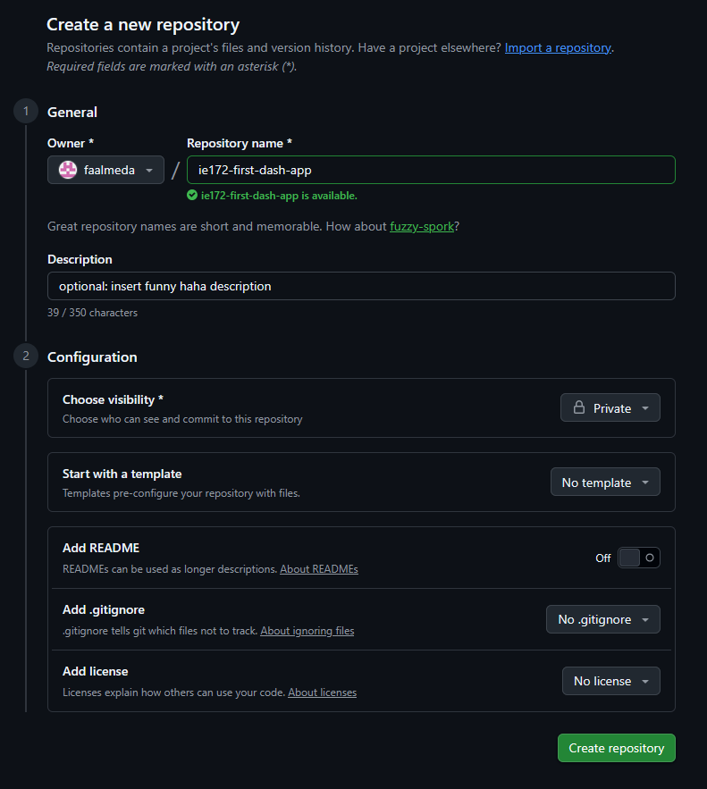
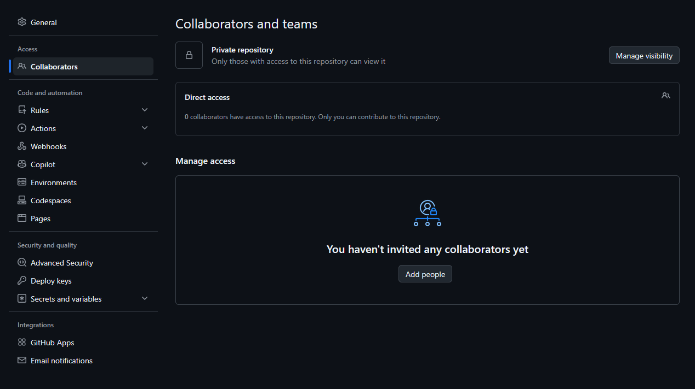

# Guide to Git: Part 1
This is a guide to using Git, a version control tool used for collaborative programming. For more information, visit the [Git documentation website](https://git-scm.com/docs).

---

# Table of Contents
- Guide to Git: Part 1
- Table of Contents
- Git Setup
    - STEP 1: Install Git
    - STEP 2: Create Git via GitHub
    - STEP 3: Add members to Repository
- Cloning a GitHub Repository
- Committing
---

# Git Setup

This sections will be done by the group member responsible for the creation of the group's git repository. Other members will have to wait until the **'repo'** has been setup.

Feel free to create your own personal repositories as practice.

## STEP 1: Install Git
- Check first if your computer already has a version of Git by running in your Terminal:
```git --version```
- Navigate and download the appropriate installation package [here](https://git-scm.com/install/).

## STEP 2: Create Git via GitHub
- Visit [github.com](github.com) to create an account, edu email is recommended.
- Once your account is setup, you will be greeted with the following homepage.

- Create a new repository by clicking the appropriate button on the left sidepanel. You may follow the setup below: 

- You will land on this page once your new repo has been created.


## STEP 3: Add members to Repository
- On the same repository page, click ```Invite collaborators``` or go to the **Settings** tab and click the "Collaborators" sidepanel tab.

- Proceed to add members to your repository. Ensure that they already have a GitHub account.
---

# Cloning a GitHub Repository

So far you have created a **"remote repository"** - a version of your files that lives in GitHub servers. 

> "Cloning" = syncing the repository from the cloud to your local machine (i.e. your laptop, lab computers, etc.)

Cloning a remote repo will initialize a **"local repository"** that lives in your physical computer when necessary.

