# Guide to Git: Part 1

This is a guide to using Git, a version control tool used for collaborative programming. For more information, visit the [Git documentation website](https://git-scm.com/docs).

---

## Table of Contents

- **[Guide to Git: Part 1](#guide-to-git-part-1)**
- **[Table of Contents](#table-of-contents)**
- **[Git Setup](#git-setup)**

  - STEP 1: Install Git
  - STEP 2: Create Git via GitHub
  - STEP 3: Add members to Repository

- **[Cloning a GitHub Repository](#cloning-a-github-repository)**
- **[Commits](#commits)**

---

## Git Setup

This sections will be done by the group member responsible for the creation of the group's git repository. Other members will have to wait until the **'repo'** has been setup.

Feel free to create your own personal repositories as practice.

### STEP 1: Install Git

- Check first if your computer already has a version of Git by running in your Terminal:
`git --version`
- Navigate and download the appropriate installation package [right here](https://git-scm.com/install/).

### STEP 2: Create Git via GitHub

- Visit [github.com](github.com) to create an account, edu email is recommended.
- Once your account is setup, you will be greeted with the following homepage.
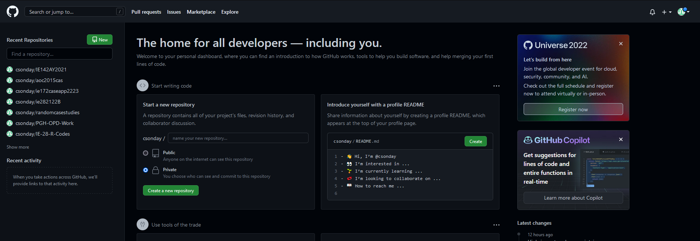
- Create a new repository by clicking the appropriate button on the left sidepanel. You may follow the setup below:

- You will land on this page once your new repo has been created.
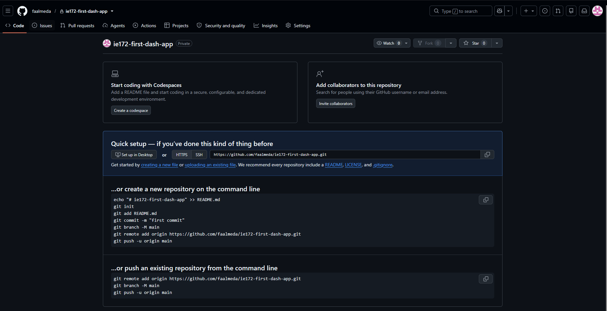

### STEP 3: Add members to Repository

- On the same repository page, click `Invite collaborators` or go to the **Settings** tab and click the "Collaborators" sidepanel tab.

- Proceed to add members to your repository. Ensure that they already have a GitHub account.

---

## Cloning a GitHub Repository

So far you have created an empty **"remote repository"** - a version of your files that lives in GitHub servers.

> **Cloning** = syncing the repository from the cloud to your local machine (i.e. your laptop, lab computers, etc.)

Cloning a remote repo will initialize a **"local repository"** that lives in your physical computer when necessary.

- git clone instructions were referenced from this [documentation webpage](https://docs.github.com/en/repositories/creating-and-managing-repositories/cloning-a-repository#cloning-an-empty-repository).

- To clone using the https option, proceed to the code tab.
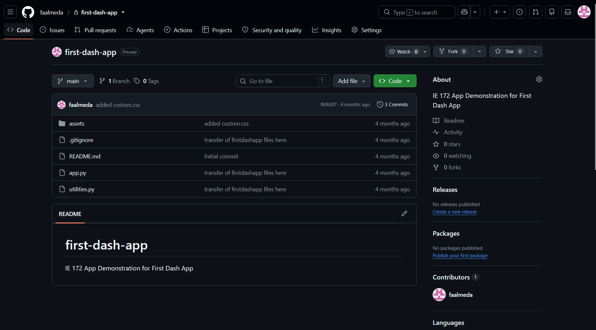

- Click the green "Code" dropdown, and go to the Local > HTTPS tab.
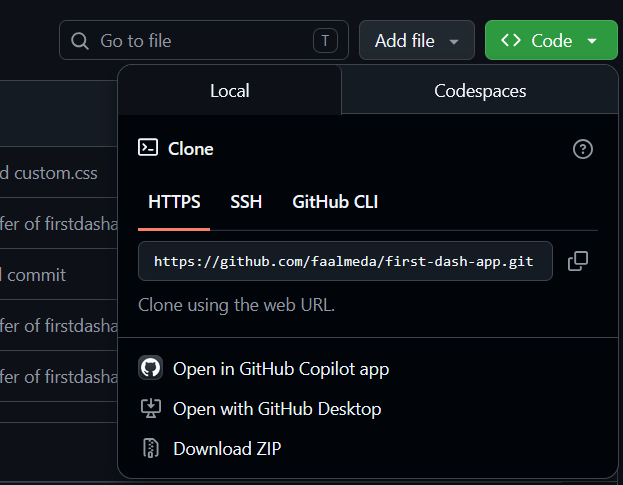

- **Copy the given HTTPS URL provided.**

- Open a terminal. Ensure that you setup the directory to your preferred location where you want to put your git local repo using ```cd <filepath>```.
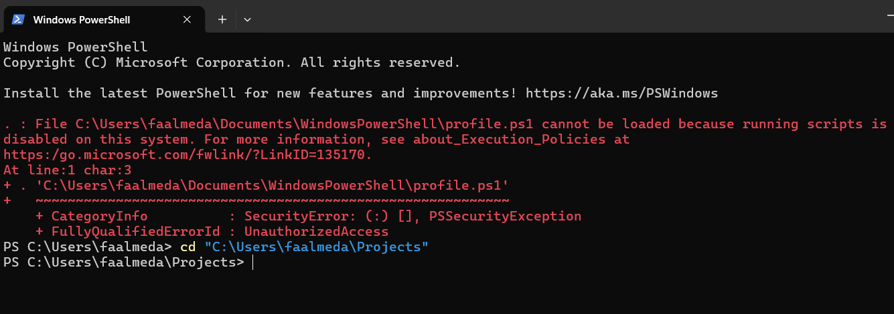

- From here, exceute ```git clone <https link from GitHub>``` to clone the repository.
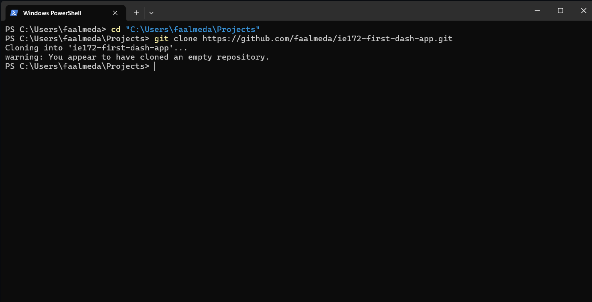

- You may check the file location to see the created clone of your remote repository.

---

## Commits

Commits are 'changes' to your repository at a specific point in time. This is basically creating a save point for your project. If you make a mistake, it is easy to rollback your work to a specific commit where everything was still working.

- Copy your project files into your new repo clone, if any.
  - *YOU MAY WANT TO EXCLUDE YOUR VENV FOLDER.* Generally, a venv should be personal/local to your computers.

- Upon copying, the files will not be synced to the cloud yet. You need to **commit** and **push** your changes.

1. Add the repository into VS Code.
    - On VS Code, you may add/navigate the folder you cloned from GitHub.
    - Press ```Ctrl + [K] [O]``` in VS Code to select your cloned folder as your directory.

2. The .gitignore file
    - The .gitignore text file tells Git not to sync specific files into the remote repository.
        - Venvs, database backups, and .env files are usually included in the ignore list.
    - If there isnt one, create a file named ".gitignore".
    - Write the files that you dont want syncing with remote.

    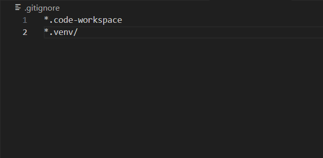

3. Staging changes
    - "Staging" is to add/select the files that you want to include into your next commit.
    - Do this by executing `git add .` in your terminal. The `.` means all. You can cherry pick files/folders you want but this is rarely used.

    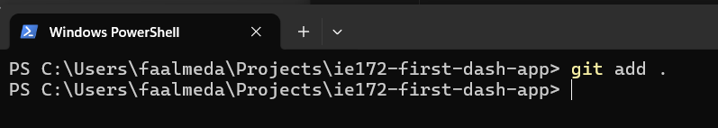

    - You can also do this in VS Code or in the VS Code terminal.

    VS Code (Terminal):

    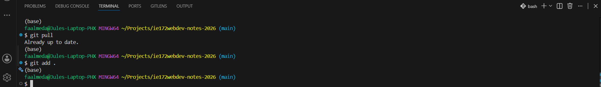

4. Commit the changes
    - Once you have staged your files, you COMMIT them so that you can add details about the changes.
    - In git, we track histories by looking at COMMITS. You can always go back to a commit if you want an older version of your repo/project.
    - In your terminal (or VS Code Terminal), use the command ```git commit -m <description here>```.

    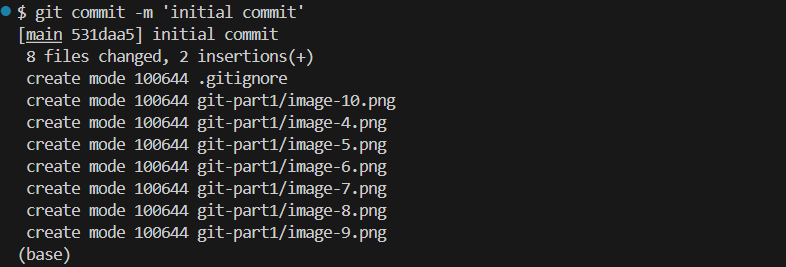

    VS Code (Source Control) Commit Button:

    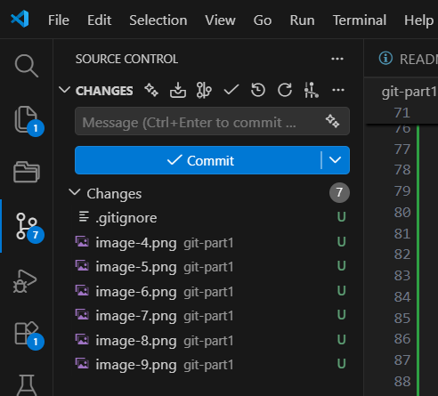

    - *Note that you have only updated your local repo so far, not the remote repo.*

    > How often should we be committing?
    > **Commit early, commit often, commit after.**
    > You want to commit everytime you write a logical piece of working code (not necessarily every line of code). This way, you can reliably revert to a version of your codebase where everything is stable and working.
    -**Small increments of commits** are key to good version control and collaborative development.
    > See what others are saying about this [right here](https://stackoverflow.com/questions/107264/how-often-to-commit-changes-to-source-control).

5. Push the changes

    - Lastly, PUSHING means to sync your commits from your local repo to the remote repo.
    - Run the command ```git push```.

    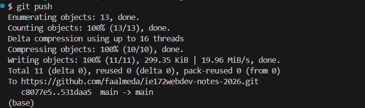

---

## SUCCESS

You have now setup your remote repo. Check your GitHub repository page to verify these changes.

At this point your groupmates can now clone your repository so that they can push and pull updates.
