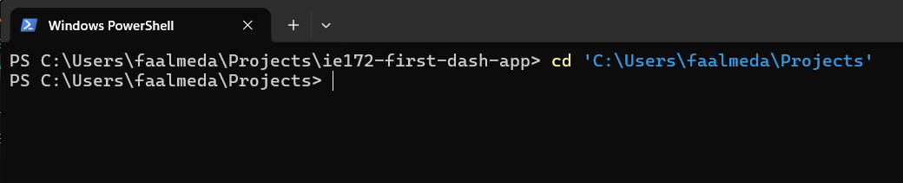
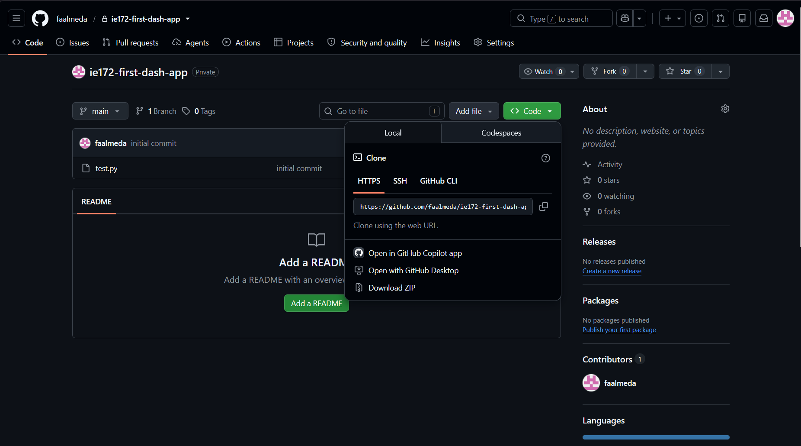
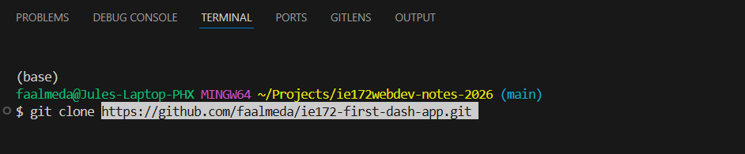
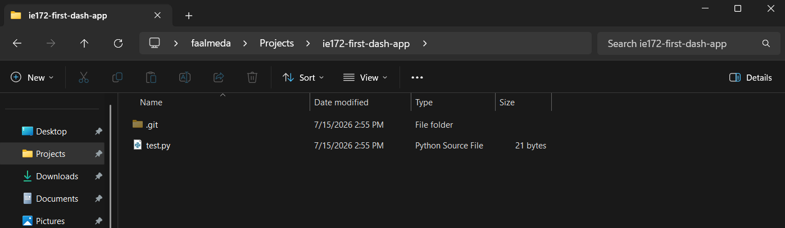
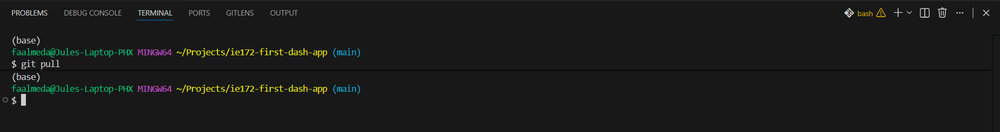
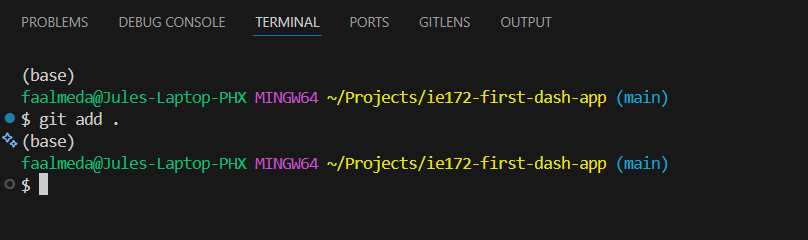
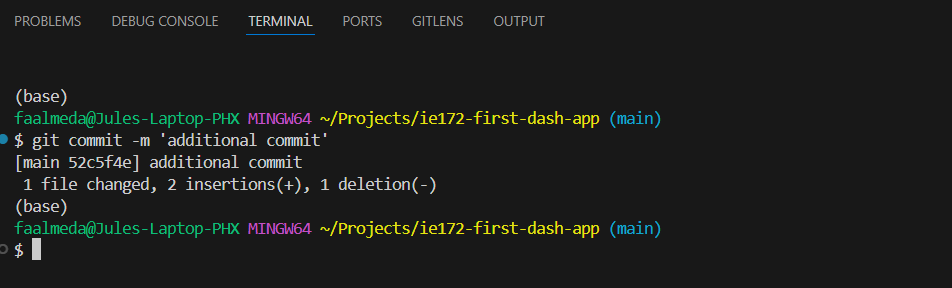
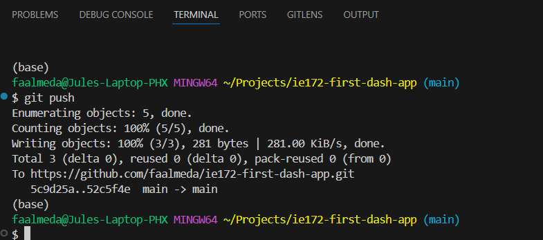

# Guide to Git: Part 2

This is a guide to using Git, a version control tool used for collaborative programming. For more information, visit the [Git documentation website](https://git-scm.com/docs).

---

- [Guide to Git: Part 2](#guide-to-git-part-2)
- [Preliminaries](#preliminaries)
- [Cloning an existing Repository](#cloning-an-existing-repository)
- [Pushing and Pulling Changes](#pushing-and-pulling-changes)
  - [`git pull`](#git-pull)
  - [Uploading Changes into the Git](#uploading-changes-into-the-git)
- [SUCCESS](#success)

## Preliminaries

1. Create your account on GitHub.com.
2. Your Git should by accessible to you. Consult your groupmate who setup the Git repository via GitHub.
3. Install git on your PC/Mac. Find the appropriate installer [right here](https://git-scm.com/downloads).

## Cloning an existing Repository

1. Cloning = copy the git on your local machine from the cloud
2. Open a terminal (can be in VS Code). Point it to a directory where you want the cloned repo will be.

3. Go to your project's GitHub repo page.
4. Proceed to the Code button and copy the HTTPS link

5. On the terminal, run the command `git clone <HTTP LINK HERE>`

After cloning your git, you should see the files in your preferred folder.

## Pushing and Pulling Changes

### `git pull`

- Before coding anything, you want to update your copy of the codes.
- While inside the folder of your repo, run `git pull` to pull any changes uploaded by your peers.

## Uploading Changes into the Git

To upload changes on the codes, you need to STAGE, COMMIT, then PUSH the changes to update remote repo.

The following include the specific steps to updating the git from your PCs.

1. STAGE the changes
    - "Staging" is to group the changes to upload to the remote repo.
    - Do this by sending the command `git add .` on the terminal. The `.` means "all". You can cherry pick files/folders you want to stage but this is rarely used.

2. COMMIT the Changes
    - Once you've grouped the changes to upload, you COMMIT them so that you can add details about the changes.
    - In git, we track histories by looking at COMMITS. You can always go back to a commit if you want an older version of a file.
    - Here, we use the command `git commit -m '<description here>'`
    - You can also do it via VS Code

3. PUSH the Commits
    - "Pushing the commits" means sync the commits from your computer (i.e. local repo) to the cloud (i.e. remote repo).
    - do this with the command `git push`

## SUCCESS

You are now able to share your code with your peers. With Git, you can also get back to previous versions of your codes, in case they stop working.

Generally, here is the cycle for the workflow: **PULL -> (DO CODE -> STAGE -> COMMIT -> ) -> PUSH**.
