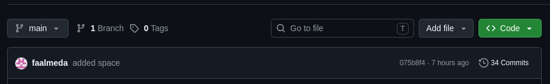
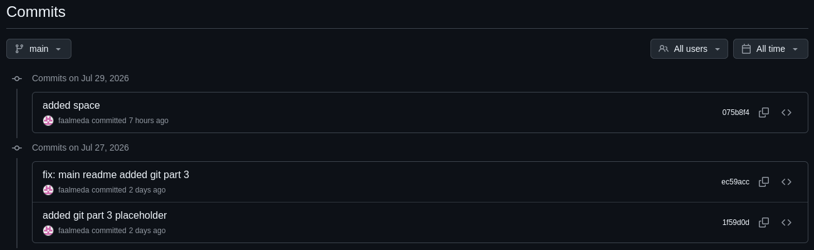
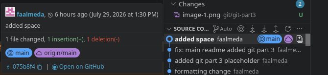
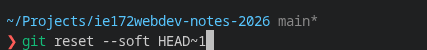
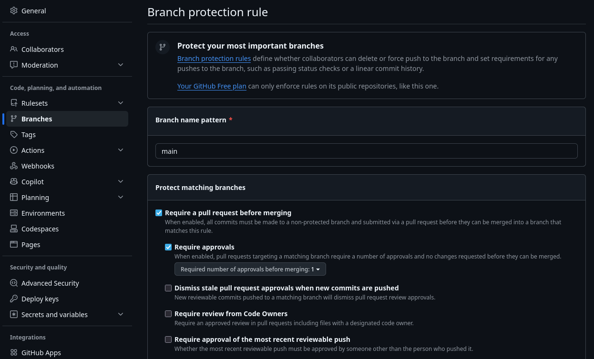
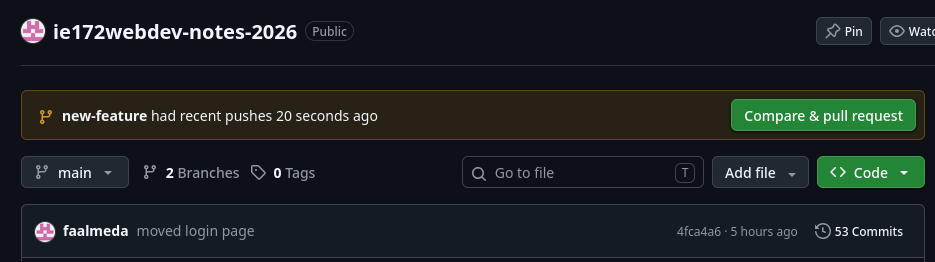

# Guide to Git: Part 3

This is a guide to using Git, a version control tool used for collaborative programming. For more information, visit the [Git documentation website](https://git-scm.com/docs).

---

- [Guide to Git: Part 3]
- [Preliminaries](#preliminaries)
- [Undoing a commit](#undoing-a-commit)
- [Developing new features using branches](#developing-new-features-using-branches)
  - [Branches](#branches)
  - [git merge and rebase](#git-merge-and-rebase)
  - [GitHub Pull Requests](#github-pull-requests)
- [Other Git Tools](#other-git-tools)

## Preliminaries

1. Create your account on GitHub.com.
2. Your Git should by accessible to you. Consult your groupmate who setup the Git repository via GitHub.
3. Install Git on your PC/Mac. Find the appropriate installer [righthere](https://git-scm.com/downloads).
4. Ensure that your repository is connected to VSCode.

---

> **CAUTION**: The following are advanced uses of git as version control. It is recommended to go over Guide to Git Parts 1 and 2 first, plus some time and practice in using git with your projects and code.

## Undoing a commit

If you accidentally `git commit` a mistake that you want to undo, there are two approaches on how to fix it:

1. Create another commit that fixes the mistake e.g. `git commit -m 'undone the previous commit'`
2. Delete/revert the commit containing the mistake

What you will do will depend on whether you have pushed the erroneous code or not.

---

### If you have already pushed the mistake code in the remote repo

- Use `git revert <commit-hash>` to create a commit that is the exact opposite of a specific commit.
  - A commit hash is a unique identifier composed of numbers and lowercase letters that can be found in either GitHub or VSCode.
  - You also have the option to simply create a normal `git commit -m <summary>` to undo any errors in the code.
  
  **In GitHub:**
  Click the list of commits (the one that says <#> commits)

  

  From there you can see the list of commits you and others have pushed into the remote repo.

  

  **In VSCode**
  Using the Source Control extension, you can hover over a commit and copy the hash from there.

  

---

### If you have not pushed the code and the mistake only exists locally

- Run `git reset --soft HEAD~1`
  - This command undoes the most recent commit, but keeps all your edited code safe in your workspace.

  

  - To clear all edited code, replace `--soft` with `--hard` to undo any changes to the workspace.
    - Doing this rolls your code back to the last working commit.

---

## Developing new features using branches

When working on a project, you want to keep your `main` branch stable and functional. If you are adding a new feature or fixing a bug, doing it directly on `main` is risky. This is where branching comes in.

### Branches

A branch represents an independent line of development. Think of it as a parallel universe where you can experiment, make mistakes, and build features without affecting the main codebase.

```text
        (feature/login-page)
       o---o---o
      /
 o---o---o (main)
```

**Essential Branching Commands:**

- **List all branches:**
    `git branch` (The branch with an asterisk `*` is your current active branch).
- **Create a new branch:**
    `git branch <branch-name>` (e.g., `git branch feature/login-page`).
- **Switch to a branch:**
    `git switch <branch-name>` or `git checkout <branch-name>`.
- **Create and switch in one command (Recommended):**
    `git switch -c <branch-name>` or `git checkout -b <branch-name>`.

Once you are on your new branch, you can `git add` and `git commit` as usual. These commits will only exist on this specific branch.

---

### git merge and rebase

Once your new feature is complete (and you are confident that it won't break your application), you need to integrate your branch back into the `main` branch. Git provides two main ways to do this: **Merging** and **Rebasing**.

**1. Git Merge**
Merging takes the contents of a source branch and integrates them into a target branch.

```text
        (feature-branch)
       o---o---o
      /         \
 o---o---o-------o (main)
                 ^ (Merge Commit)
```

- **How to do it:** First, switch to the target branch (`git switch main`), then run `git merge <feature-branch>`.
- **What it does:** It creates a new "merge commit" that ties the histories of both branches together.
- It is safe and preserves the exact chronological history of your project.

**2. Git Rebase**
Rebasing is an alternative to merging that creates a cleaner, perfectly linear project history.

```text
[Before Rebase]
          A---B---C (feature-branch)
         /
    D---E---F---G (main)

[After git rebase main]
                  A'---B'---C' (feature-branch)
                 /
    D---E---F---G (main)
```

- **How to do it:** While on your feature branch, run `git rebase main`.
- **What it does:** It temporarily sets aside your feature branch commits, updates your branch with the latest changes from `main`, and then re-applies your feature commits on top of it.
- It eliminates unnecessary merge commits, making the project history much easier to read.
- > **DANGER:** **Never rebase a shared branch.** Because rebasing rewrites commit history, doing it on a branch that other developers are actively using will cause massive merge conflicts for your team. Only rebase your local, private branches.

**3. Creating the branch in the remote repository**
After creating your branch at the local repository, there needs to be a branch setup in your remote repository if it is your first time pushing from the new branch.

- Simply run `git push -u origin <branch-name>` to create the branch in remote and push your changes.
- You can run `git push` normally after you have an existing branch in the remote.

---

### GitHub Pull Requests

In a collaborative environment, you rarely merge your own code directly into `main` locally. Instead, you use a **Pull Request (PR)** on GitHub if branch protection is setup.

#### **Setting Up Branch Protection**

  1. Navigate to your repository on GitHub and click the Settings tab.
  2. In the left sidebar under "Code and automation," click Branches.
  3. Click the Add branch protection rule button.
  4. Type your target branch name (e.g., main) into the Branch name pattern field.
  5. Check the boxes for your desired protections (e.g., Require a pull request before merging and Require approvals).

  

  6. Click Create at the bottom of the page to save.

A Pull Request is a feature of GitHub (and other remote hosts) that tells your team about changes you've pushed to a branch. It allows your peers to review your code, discuss modifications, and approve it before it officially becomes part of the main codebase.

> Note: Technically, if you have push access, you can bypass PRs entirely and push commits directly on the main branch. This is merely a safety feature that ensures main is always stable.

**The Pull Request Workflow:**

  1. **Push your branch to GitHub:**
      `git push -u origin <branch-name>`
  2. **Open GitHub:** Navigate to your repository in the browser. You will usually see a green **"Compare & pull request"** button appear automatically.

  

  3. **Create the PR:** Click the button, give your PR a descriptive title, and outline what changes you made in the description box.
  4. **Review and Approve:** Tag your teammates as reviewers. They can leave comments or request changes directly on specific lines of code.
  5. **Merge:** Once approved, click the **"Merge pull request"** button on GitHub. Your code is now successfully integrated into `main`!

---

## Other Git Tools

As you become more comfortable with Git, these advanced commands might help you in certain situations:

- **`git status`**
    Command to check which branch you are working on and if you have pending changes to commit. Handy if your project has multiple branches.

- **`git stash`**
    If you are in the middle of working on a file but need to switch branches quickly to fix a bug, you can't switch if you have uncommitted changes. Run `git stash` to temporarily shelf your uncommitted changes. Once you are done fixing the bug, come back to your branch and run `git stash pop` to bring your half-finished work back.

- **`git cherry-pick <commit-hash>`**
    Imagine you made a great commit on the wrong branch. Instead of rewriting it, you can switch to the correct branch and use `cherry-pick` to grab that specific commit by its hash and apply it exactly where you need it.

- **`git log --graph --oneline`**
    This provides a beautiful, color-coded visual representation of your branch history and merges right inside your terminal.

- **VSCode Source Control Extension**

    While using the terminal is powerful, Visual Studio Code includes a built-in GUI that simplifies version control tasks. You can access it by clicking the branch icon on the Activity Bar (or pressing Ctrl+Shift+G / Cmd+Shift+G).

  - Staging Changes: Click the + icon next to a file to run git add.
  - Committing: Type your summary in the text box and click Commit (equivalent to git commit -m).
  - Syncing: Click the Sync Changes button to push your local commits and pull remote updates simultaneously.
  - Viewing Diffs: Clicking on any modified file opens a split-screen view showing the exact lines you added or removed compared to the previous commit.

For full details on navigating this interface, refer to the [VSCode Version Control Documentation](https://code.visualstudio.com/docs/sourcecontrol/overview).

---

## SUCCESS

You may now safely develop new features without disrupting your main branch, code away!
