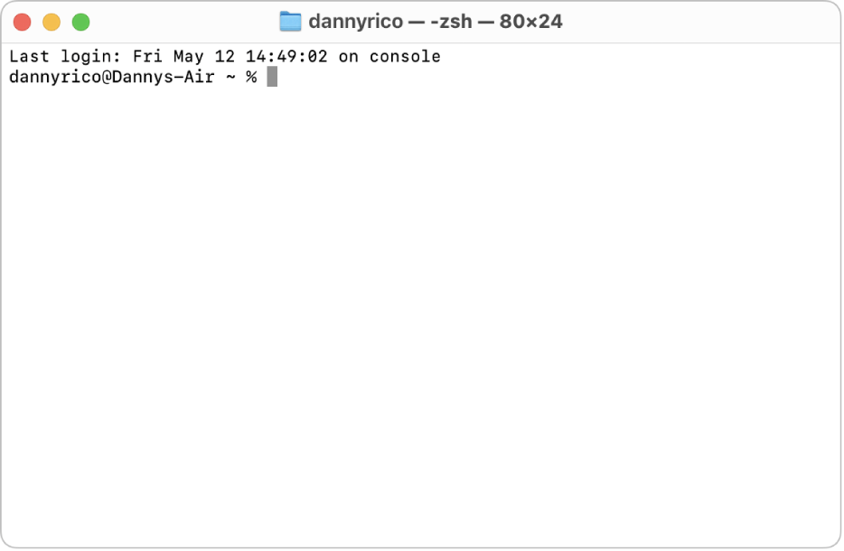
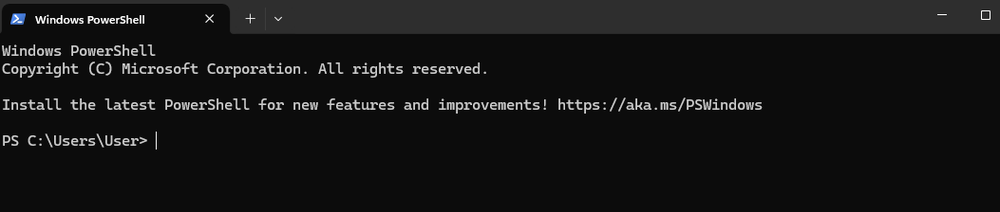
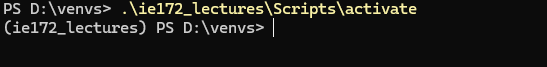
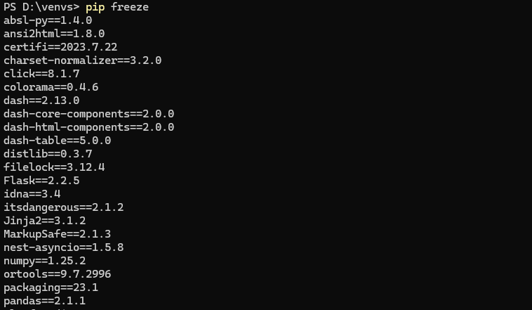
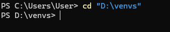

# Module 1a: Python Virtual Environments

## Table of Contents

1. [Preliminaries](#1-preliminaries)
2. [Python Virtual Environments](#2-python-virtual-environments)
3. [Creating your First Venv](#3-creating-your-first-venv)
    * 3.1. [Decide the Location](#31-decide-the-location)
    * 3.2. [CLI Basics](#32-cli-basics)
    * 3.3. [Proceed to the Venv folder using the CLI](#33-proceed-to-the-venv-folder-using-the-cli)
    * 3.4. [Install `virtualenv`](#34-install-virtualenv)
    * 3.5. [Create your venv](#35-create-your-venv)

4. [Activate your Venv](#4-activate-your-venv)
    * 4.1. [What makes this venv new?](#41-what-makes-this-venv-new)
    * 4.2. [Activate the Venv](#42-activate-the-venv)
        * 4.2.1. [Windows](#421-windows)
        * 4.2.2. [Mac](#422-mac)
    * 4.3. [Deactivating a Venv](#43-deactivating-a-venv)

5. [Setting up on VS Code](#5-setting-up-on-vs-code)
    * 5.1. [Open your VS Code Workspace](#51-open-your-vs-code-workspace)
    * 5.2. [Select a Python Interpreter](#52-select-a-python-interpreter)
    * 5.3. [Verify the Interpreter](#53-verify-the-interpreter)

6. [Add on: VS Code Terminal](#6-add-on-vs-code-terminal)
7. [METHOD 2: Via VS CODE](#7-method-2-via-vs-code)
    * 7.1. [Activate your workspace](#71-activate-your-workspace)
    * 7.2. [Create your venv](#72-create-your-venv)
    * 7.3. [Check if you have the correct installation](#73-check-if-you-have-the-correct-installation)

---

## 1. Preliminaries

For this section, you will need access to the following:

* Internet connection
* Access to CLI Terminals (Windows PowerShell, macOS Terminal, CMD)

## 2. Python Virtual Environments

Generally, a **Python Virtual Environment** is an isolated space within your computer where you can work on your Python projects—separately from your system-installed Python [^1].

**Why?**

In web development, all projects do not have the same dependencies or packages. Some projects will require `pandas`, while others don't. Some projects need special packages for AI, and some do not.

To deploy a web application, you have to configure a *Virtual Machine (VM)* based on the Python settings of your project. A VM is a remotely accessible computer—usually connected to a network for web deployment. When a VM is created for a project, it is literally a computer with no applications, only the operating system. You will need to install the required applications.

**How does a Python Environment help with that?**

When a virtual environment is created, it is a *vanilla* Python—i.e., no configurations, no installed dependencies. You get to start from scratch, and you get to track your configurations. It's like cloning your Python so each project gets its *custom* Python build.

## 3. Creating your First Venv

Follow these steps to create your first virtual environment (venv).

### 3.1. Decide the Location

Create a location for your venv.
Personally, I put it in a folder away from my `.py` scripts. Usually, you share the folder containing your scripts with your co-developers, but you do not share the folder containing your venv.

Pick a convenient location on your PC. For example, I have a fixed directory for venvs: `D:\venvs\`.



### 3.2. CLI Basics

Open your preferred CLI (CMD, Windows PowerShell, macOS Terminal). For macOS users, search for the Terminal App. For Windows, search for PowerShell.

A terminal is basically a file explorer, but instead of clicking icons, you enter commands. When you open a terminal, you get the following view:


*(Windows PowerShell view)*


*(macOS view - Photo grabbed from Apple Support)*

You can see here that you are at a particular directory. For the PowerShell screenshot, we have `Users`, while we have `Dannys-Air` for the Terminal one.

Basic commands you should know:

* `ls` -- Lists the contents of the current directory.
* `cd <path>` -- Changes directory to the specified path. The path can simply be a folder name inside the current directory.
* `cd ..` -- Go up one folder above.

### 3.3. Proceed to the Venv folder using the CLI

First, get the path to your venv folder. The easiest way to do this is via your file explorer.Locate your folder and `Right-click > Copy as Path`.
Proceed to your terminal and type the following:

```(terminal)
cd "<path>"
```

Replace `<path>` with the path you copied. The double-quotes may be important here.
After pressing Enter/Return, you get the following.



###  3.4. <a name='Installvirtualenv'></a>Install `virtualenv`

The package `virtualenv` creates your Venvs for you. Installing it requires the Internet.

On your Terminal, type the following:

```(terminal)
pip install virtualenv
```

MacOS users may require `pip3` instead of `pip`.

###  3.5. <a name='Createyourvenv'></a>Create your venv

Creating virtual environments has the following syntax:

```(terminal)
virtualenv <environment_name>
```

The environment name is used for quick identification.

Let's create your new venv. Run the following scripts.

```(terminal)
virtualenv ie172_lectures
```

This might take a while. It's done when the cursor starts blinking again. You may also verify this by running the following on your terminal:

```(terminal)
ls
```

Or, just checking your file explorer for a new folder named `ie172_lectures`

##  4. <a name='ActivateyourVenv'></a>Activate your Venv

###  4.1. <a name='Whatmakesthisvenvnew'></a>What makes this venv new?

As mentioned earlier, venvs are "clean clones" of Python. To compare, execute the following to show the installed dependencies in your system-installed Python.

```(terminal)
pip freeze
```

*MacOS might use `pip3`

For my case, here are the dependencies.


Take note of these outputs.

###  4.2. <a name='ActivatetheVenv'></a>Activate the Venv

####  4.2.1. <a name='Windows'></a>Windows

For Windows users, want to run the `activate` file inside your venv folder. Generally, it's in the following directory:

```(terminal)
<venvname>/Scripts/activate
```

In case you are using Bash, activating the venv will look like this:

```(bash)
source <venvname>/Scripts/activate
```

If you run `ls` and your venv folder is there, simply run the script above -- remember to replace the appropriate venvname.

####  4.2.2. <a name='Mac'></a>Mac

Make sure that when you run `ls`, your venv folder shows up. Here's your syntax to activate your venv.

```(terminal)
source <venvname>/bin/activate
```

`source` simply means to execute the specified file in the given directory.

For either OS, you know that the venv is activated when you have the venvname near the cursor.


With your venv active, run `pip freeze`. What's the difference?

All py files run via this terminal instance will now use the venv as its Python.

###  4.3. <a name='DeactivatingaVenv'></a>Deactivating a Venv

When a venv is active, run the following to deactivate it.

```(terminal)
deactivate
```

Any py files run from now on will use the system-installed Python.

##  5. <a name='SettinguponVSCode'></a>Setting up on VS Code

When you activate a venv, it's only active *for that window*. VS Code assists us so that whenever we open a project or workspace, it retains the activation of a venv.

###  5.1. <a name='OpenyourVSCodeWorkspace'></a>Open your VS Code Workspace

If you don't have a workspace yet, open VS Code and your folders. Proceed to `File > Save Workspace As...` then click Save.

*Why do we like workspaces?* These workspaces come in handy when we have projects with specific setups. When it comes to venvs, different projects have different venvs. Workspaces save us time by remembering the venvs for each workspace.

###  5.2. <a name='SelectaPythonInterpreter'></a>Select a Python Interpreter
A **Python Interpreter** is a Python *instance* that is used to execute Python programs. We now know that a PC can have many Python instances.

In VS Code, you may start by opening the Command Palette by `Ctrl-Shift-P` or `Cmd-Shift-P`. Type in `Interpreter`. Select `Python: Select Interpreter`.



Pick `Enter interpreter path` > `Find`.

Locate your venv folder, then select the following file: `Scripts/python`



###  5.3. <a name='VerifytheInterpreter'></a>Verify the Interpreter

For this one, open or create a py file. The active Python interpreter should be reflected at the bottom status bar.


##  6. <a name='Addon:VSCodeTerminal'></a>Add on: VS Code Terminal

VS Code also has a terminal -- same terminal as the one you used before but inside VS Code. When working on projects, this can be convenient to use because of the following:

* venv is automatically active (if your workspace has a venv)
* It automatically points to your project directory

[^1] https://www.geeksforgeeks.org/python-virtual-environment/
[^notes] All these scripts were tailor-fit to the needs of the course.

##  7. <a name='METHOD2:ViaVSCODE'></a>METHOD 2: Via VS CODE

###  7.1. <a name='Activateyourworkspace'></a>Activate your workspace

1. Check the window name if there is an open workspace -- you can see `Workspace` on it.
   1. If there is an open workspace, go to `File > Close Workspace`.
2. If you do not have a workspace yet
   1. Open the folder where your class notes are
   2. Go to `File > Save Workspace As...` and press Save.
3. If you have a workspace...
   1. Open your workspace via `File > Open Workspace from File...` Search for your `.code-workspace` file in your folders

###  7.2. <a name='Createyourvenv-1'></a>Create your venv

1. Open VS Code.
2. Press `Ctrl + Shift + P` or `Cmd + Shift + P`.
3. Search for `Python: Select Interpreter`.
4. Select `+ Create Virtual Environment`
5. Select `Venv`
6. Select your workspace.
7. Select the Python version that you want. Pick the latest version.
8. Wait fo venv to install.

###  7.3. <a name='Checkifyouhavethecorrectinstallation'></a>Check if you have the correct installation

1. Open a terminal in VS Code. `Terminal > New Terminal...`
2. Execute `pip freeze` in your terminals.
