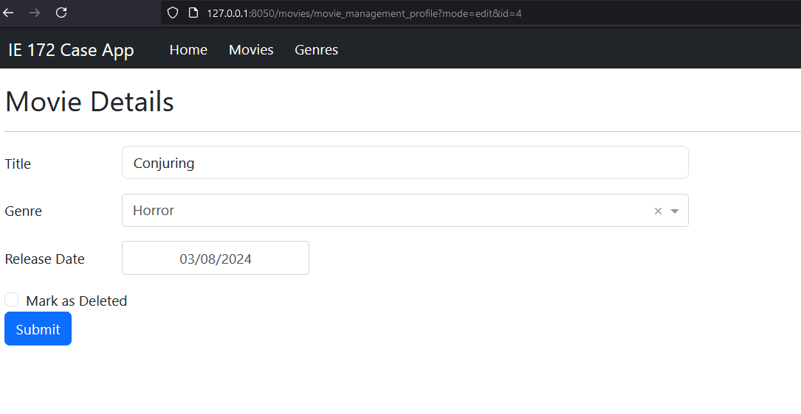

# Module 3b: Setting-up the Edit Function
<!-- vscode-markdown-toc -->
1. [Preliminaries](#1-preliminaries)
2. [Setup the Add Mode](#2-setup-the-add-mode)

    * 2.1. [Use the parameters from the URL](#21-use-the-parameters-from-the-url)
    * 2.2. [Parse the value for mode from the URL parameters](#22-parse-the-value-for-mode-from-the-url-parameters)
    * 2.3. [Add a conditional using `create_mode`](#23-add-a-conditional-using-create_mode)

3. [Setup the Edit Mode](#3-setup-the-edit-mode)

    * 3.1. [Setup a storage for `movie_id`](#31-setup-a-storage-for-movie_id)
    * 3.2. [Setup a value for `movieid`](#32-setup-a-value-for-movieid)
    * 3.3. [Add a callback to populate the fields](#33-add-a-callback-to-populate-the-fields)
    * 3.4. [Updating the movie](#34-updating-the-movie)

4. [Deleting in edit mode](#4-deleting-in-edit-mode)

    * 4.1. [Add a tickbox for deletion](#41-add-a-tickbox-for-deletion)
    * 4.2. [Show the tickbox only when in Edit Mode](#42-show-the-tickbox-only-when-in-edit-mode)
    * 4.3. [Update the database](#43-update-the-database)

<!-- vscode-markdown-toc-config
	numbering=true
	autoSave=true
	/vscode-markdown-toc-config -->
<!-- /vscode-markdown-toc -->

## 1. Preliminaries

Module 3a should be done at this point.

Furthermore, since we will be looking at URL parameters, we need to load a tool to help us read them from the URL.

```python
from urllib.parse import urlparse, parse_qs
```

## 2. Setup the Add Mode

We have to edit the way we update the database. Now that we have `modes`, let us incorporate them into how wo use the form.

### 2.1. Use the parameters from the URL

In the callback `movieprofile_saveprofile`, we need to setup an additional `State` so we could use the parameters in the URL.

```python
        State('url', 'search'),
```

Do not forget to add a variable to receive the value from this state.

```python
def movieprofile_saveprofile(submitbtn, title, genre, releasedate, urlsearch):
```

### 2.2. Parse the value for mode from the URL parameters

Parsing is the process of breaking down the parts of a string to get the relevant parts. From the variable `urlsearch`, we would like to parse the current `mode` of the page.

Add the following lines below the definition for `eventid`

```python
        parsed = urlparse(urlsearch)
        # get the corresponding value for 'mode' from the URL
        create_mode = parse_qs(parsed.query)['mode'][0]
```

### 2.3. Add a conditional using `create_mode`

We would like to add a conditional statement to control how details are saved based on the value of `create_mode`.

```python
            if create_mode == 'add':
                sql = '''
                    INSERT INTO movies (movie_name, genre_id,
                        movie_release_date, movie_delete_ind)
                    VALUES (%s, %s, %s, %s)
                '''
                values = [title, genre, releasedate, False]

            else:
                raise PreventUpdate
            
            modifyDB(sql, values)

            # If this is successful, we want the successmodal to show
            modal_open = True
```

At this point, you can run the app. You should be able to save any new entries when `mode=add`, but you cannot save anything to the database when `mode=edit`.

## 3. Setup the Edit Mode

At this point, we need to setup what the app does when it encounters the edit mode for the `movie_management_profile` page. To summarize, we need to add the following:

1. A way to store the `movie_id` if we are in the edit mode.
2. A way to pre-populate the field with existing db data.
3. An update query to use when we submit the form in edit mode.

### 3.1. Setup a storage for `movie_id`

A `dcc.Store` element is an invisible object that we can use to store numerals, strings, or lists. Let's add one on top of our layout for `movie_management_profile`. Your layout definition should look like the following.

```python
layout = html.Div(
    [

        dcc.Store(id='movieprofile_movieid', storage_type='memory', data=0),
        
        html.H2('Movie Details'), # Page Header
        html.Hr(),
        dbc.Alert(id='movieprofile_alert', is_open=False), # For feedback purposes
        dbc.Form(
```

Some notes on our new `dcc.Store` object

* **id** -- we need an id so we could access the value stored in this element
* **storage_type** -- this means that when we cange the URL, the memory is wiped.
* **data=0** -- we are initializing this element's value to `0`

### 3.2. Setup a value for `movieid`

Modify the callback `movieprofile_populategenres()` to include a way to store the `movie_id` from the URL.

List of changes:

1. Into the callback, update the `dcc.Store` object along with the dropdown options.
2. If `create_mode='add'`, set `movieid=0`; otherwise, get `movieid` from the URL.

Here's the resulting callback:

```python
@app.callback(
    [
        Output('movieprofile_genre', 'options'),
        Output('movieprofile_movieid', 'data'),
    ],
    [
        Input('url', 'pathname'),
    ],
    [
        State('url', 'search'),
    ]
)
def movieprofile_populategenres(pathname, urlsearch):
    if pathname == '/movies/movie_management_profile':
        sql = """
        SELECT genre_name as label, genre_id as value
        FROM genres 
        WHERE genre_delete_ind = False
        """
        values = []
        cols = ['label', 'value']

        df = getDataFromDB(sql, values, cols)
        # The output must be a dictionary with the following structure
        # options=[
        #     {'label': "Factorial", 'value': 1},
        #     {'label': "Palindrome Checker", 'value': 2},
        #     {'label': "Greeter", 'value': 3},
        # ]

        genre_options = df.to_dict('records')

        parsed = urlparse(urlsearch)
        create_mode = parse_qs(parsed.query)['mode'][0]
        
        if create_mode == 'add':
            movieid = 0
        else:
            movieid = int(parse_qs(parsed.query)['id'][0])
        
        return [genre_options, movieid]
    else:
        raise PreventUpdate
```

### 3.3. Add a callback to populate the fields

Add the following so we can setup values for the fields when we get a value for `movieid`.

```python
@app.callback(
    [
        Output('movieprofile_title', 'value'),
        Output('movieprofile_genre', 'value'),
        Output('movieprofile_releasedate', 'date'),
    ],
    [
        Input('movieprofile_movieid', 'modified_timestamp')
    ],
    [
        State('movieprofile_movieid', 'data'),
    ]
)
def movieprofile_loadprofile(timestamp, movieid):
    if movieid: # check if movieid > 0

        # Query from db
        sql = """
            SELECT movie_name, genre_id, movie_release_date
            FROM movies
            WHERE movie_id = %s
        """
        values = [movieid]
        col = ['moviename', 'genreid', 'releasedate']

        df = getDataFromDB(sql, values, col)

        moviename = df['moviename'][0]
        # Our dropdown list has the genreids as values then it will 
        # display the correspoinding labels
        genreid = int(df['genreid'][0])
        releasedate = df['releasedate'][0]

        return [moviename, genreid, releasedate]

    else:
        raise PreventUpdate
```

Try to answer the following questions based on the callback:

* What triggers the callback?
* What does the function do?

At this point, you can run the app again, and you will have a pre-populated form when you click on any of the edit buttons.



### 3.4. Updating the movie

Now, we're back to updating `movieprofile_saveprofile()`.

First off, we need to add the following state so we could access the movie id that we stored. Don't forget to add a corresponding variable in the function to receive its value.

```python
        State('movieprofile_movieid', 'data'),
```

Then, we add our `UPDATE` query:

```python
            if create_mode == 'add':
                sql = '''
                    INSERT INTO movies (movie_name, genre_id,
                        movie_release_date, movie_delete_ind)
                    VALUES (%s, %s, %s, %s)
                '''
                values = [title, genre, releasedate, False]

            elif create_mode == 'edit':
                sql = '''
                    UPDATE movies 
                    SET 
                        movie_name = %s,
                        genre_id = %s,
                        movie_release_date = %s
                    WHERE
                        movie_id = %s
                '''
                values = [title, genre, releasedate, movieid]

            else:
                raise PreventUpdate
```

You can now try to edit your records. Try saving any changes and observe these changes via pgadmin or via the app.

## 4. Deleting in edit mode

Now, let's add a feature where we can delete a record from view, but not really delete them from the database. For this one, we will still work on `movie_management_profile`.

### 4.1. Add a tickbox for deletion

We need a field where the user can indicate if/when they want to delete a record. Let's put it right below the field for Release Date, and above the submit button.

```python
                html.Div(
                    [
                        dbc.Checklist(
                            id='movieprofile_deleteind',
                            options= [dict(value=1, label="Mark as Deleted")],
                            value=[] 
                        )
                    ], 
                    id='movieprofile_deletediv'
                )
```

### 4.2. Show the tickbox only when in Edit Mode

Back to `movieprofile_populategenres()`, let's hide `movieprofile_deletediv` when we are in the add mode.

```python
@app.callback(
    [
        Output('movieprofile_genre', 'options'),
        Output('movieprofile_movieid', 'data'),
        Output('movieprofile_deletediv', 'className')
    ],
    [
        Input('url', 'pathname'),
    ],
    [
        State('url', 'search'),
    ]
)
def movieprofile_populategenres(pathname, urlsearch):
    if pathname == '/movies/movie_management_profile':
        sql = """
        SELECT genre_name as label, genre_id as value
        FROM genres 
        WHERE genre_delete_ind = False
        """
        values = []
        cols = ['label', 'value']

        df = getDataFromDB(sql, values, cols)
        # The output must be a dictionary with the following structure
        # options=[
        #     {'label': "Factorial", 'value': 1},
        #     {'label': "Palindrome Checker", 'value': 2},
        #     {'label': "Greeter", 'value': 3},
        # ]

        genre_options = df.to_dict('records')

        parsed = urlparse(urlsearch)
        create_mode = parse_qs(parsed.query)['mode'][0]
        
        if create_mode == 'add':
            movieid = 0
            deletediv = 'd-none'
        else:
            movieid = int(parse_qs(parsed.query)['id'][0])
            deletediv = ''
        
        return [genre_options, movieid, deletediv]
    else:
        raise PreventUpdate

```

### 4.3. Update the database

Back to `movieprofile_saveprofile()`, we need to incorporate the delete indicator into saving items into the database.

1. Add `movieprofile_deleteind` as a state. *Hint: State()*
2. Revise the `UPDATE` query to include `movie_delete_ind`. *Hint: modify the update query and use the value from (1) to determine the stored value for `movie_delete_ind`.*

Try out the application. Try deleting a record.
